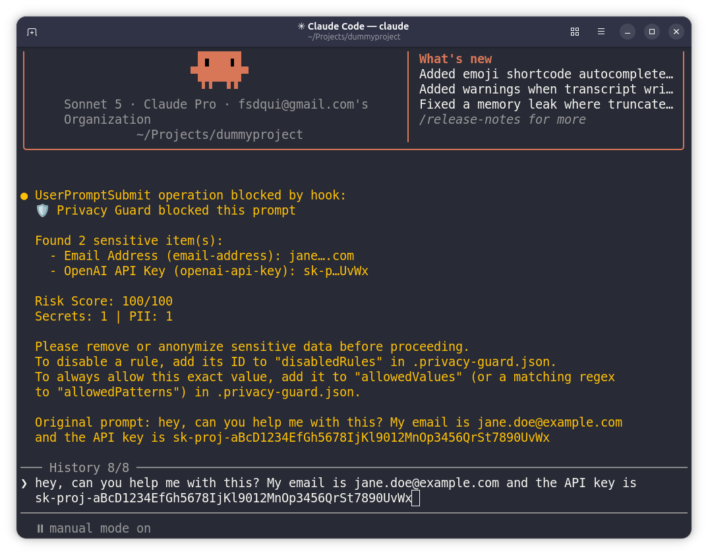

# Claude Code Privacy Guard


> 🛡️ Prevent secrets and PII from being accidentally shared with Claude Code.

A privacy-first plugin for Claude Code that scans prompts for sensitive data and **blocks** them before they reach the AI.



## Features

- ✅ **Blocks prompts** containing sensitive data before they're sent to Claude
- ✅ **Detects** PII, secrets, API keys, tokens, and sensitive information
- ✅ **Works locally** - all scanning happens on your machine
- ✅ **Zero configuration** - works out of the box
- ✅ **Detailed reporting** - shows exactly what was detected
- ✅ **Toggle rules and manage allowlists** - by hand in `.privacy-guard.json`, or via `npx claude-code-privacy-guard rules` for a local web UI

## Installation

```bash
# Add the marketplace (if not already added)
/plugin marketplace add datumbrain/claude-code-privacy-guard

# Install the plugin
/plugin install claude-code-privacy-guard
```

> **⚠️ Important: Restart Required**
>
> After installing the plugin, you must **restart your Claude Code session** for it to take effect. This is because hooks are registered at session startup - Claude Code doesn't dynamically load new hooks mid-session.
>
> Simply close and reopen Claude Code, or start a new session.

Once restarted, the plugin will automatically scan all prompts before they reach Claude.

## What Gets Detected

✅ **Secrets**
- OpenAI API keys (`sk-...`, `sk-proj-...`)
- AWS credentials
- GitHub tokens (classic and fine-grained PATs)
- GitLab tokens (personal access, deploy, runner, pipeline trigger, service account)
- Azure client secrets (Microsoft Entra ID)
- Stripe keys
- JWT tokens
- Bearer tokens
- SSH private keys
- Generic API key patterns

✅ **Personal Information (PII)**
- Email addresses

Phone numbers, Social Security Numbers, and credit card numbers are **not**
currently detected by the default configuration - see
[#7](https://github.com/datumbrain/claude-code-privacy-guard/issues/7) for
tracking status.

## How It Works

1. You type a prompt in Claude Code
2. Privacy Guard intercepts it via a `UserPromptSubmit` hook
3. Scans for sensitive data using regex patterns
4. Reacts according to the configured `mode` (see [Block, Redact, or Warn?](#block-redact-or-warn) below) - by default, **blocks the prompt** if sensitive data is found
5. Shows you exactly what was detected

Blocking relies on the `UserPromptSubmit` hook JSON protocol: the hook prints `{"decision": "block", "reason": "..."}` to stdout and exits with code `0`. (Exit code `0` is required for the JSON decision to be honored - a non-zero exit is treated as a non-blocking hook error, and the prompt would go through anyway.) A non-blocking warning uses `{"systemMessage": "..."}` instead, which surfaces the message without stopping the prompt.

## Example

**Input:**
```
My API key is sk-proj-abc123xyz and email is john@example.com
```

**Result:**
```
🛡️ Privacy Guard blocked this prompt

Found 2 sensitive item(s):
  - OpenAI API Key (openai-api-key): sk-p…3xyz
  - Email Address (email-address): john….com

Risk Score: 100/100
Secrets: 1 | PII: 1

Please remove or anonymize sensitive data before proceeding.
To disable a rule, add its ID to "disabledRules" in .privacy-guard.json.
```


## Configuration

Create a `.privacy-guard.json` file (searched upward from your current
working directory, so a repo-root or home-directory config both work) to
override the defaults. See `.privacy-guard.example.json` for a starter
file.

| Option | Type | Default | Status |
| --- | --- | --- | --- |
| `enabled` | `boolean` | `true` | ✅ Implemented. Set to `false` to disable the plugin entirely without uninstalling it. |
| `mode` | `"block" \| "redact" \| "warn"` | `"block"` | ✅ Implemented. `"block"` rejects the prompt outright. `"redact"` also blocks (the hook API can't rewrite a submitted prompt) but the block reason includes a cleaned, copy-pasteable version of your prompt so you don't have to retype it. `"warn"` lets the prompt through unchanged and shows a non-blocking warning with what was found. See [Block, Redact, or Warn?](#block-redact-or-warn). |
| `disabledRules` | `string[]` | `[]` | ✅ Implemented. Rule IDs to skip - see [Managing Rules](#managing-rules) below for how to discover and toggle IDs. |
| `externalRulesJsonPath` | `string` | `./data/regex_list_1.json` | ✅ Implemented. Path (relative to the config file's directory) to the external regex dataset. Patterns that look prone to catastrophic backtracking are skipped at load time (with a console warning) rather than risking a hang. |
| `externalRulesMode` | `"coding-only" \| "all"` | `"coding-only"` | ✅ Implemented. `"coding-only"` filters the external dataset down to rules whose name/description mentions a coding-secret keyword (key, token, secret, password, private key, etc.); `"all"` loads every external rule. |
| `allowedDomains` | `string[]` | `[]` | ✅ Implemented. Email domains to allow through the `email-address` rule. An entry matches the exact domain or any subdomain (e.g. `example.com` allows `a@example.com` and `a@mail.example.com`); matching is case-insensitive. |
| `allowedValues` | `string[]` | `[]` | ✅ Implemented. Exact matched values to always allow, from any rule (e.g. a documented example key). Comparison is case-sensitive against the raw matched text. |
| `allowedPatterns` | `string[]` | `[]` | ✅ Implemented. Regexes; a finding whose matched text satisfies any of these is always allowed, from any rule. Patterns that fail to compile or look prone to catastrophic backtracking are skipped with a console warning. |

Example:

```json
{
  "enabled": true,
  "allowedDomains": ["example.com"],
  "allowedValues": [],
  "allowedPatterns": [],
  "disabledRules": [],
  "externalRulesJsonPath": "./data/regex_list_1.json",
  "externalRulesMode": "coding-only"
}
```

## Managing Rules

Every detection rule - built-in and external - has a stable `id` (e.g. `email-address`, `openai-api-key`, `external-slack-api-token`). Blocked prompts now show each finding's ID directly, so you always know what to put in `disabledRules`.

To manage rules and allowlists without hand-editing the config, run:

```bash
npx claude-code-privacy-guard rules
```

This starts a local-only web UI (bound to `127.0.0.1`, never exposed to your network) with two tabs:

- **Rules** - every rule with its ID, title, severity, and category. Unchecking one saves it to `disabledRules`.
- **Allowlists** - add/remove entries for `allowedDomains`, `allowedValues`, and `allowedPatterns`. Regexes are checked for validity and catastrophic backtracking as you type, using the same `safe-regex2` check the scanner applies at load time - so a pattern the UI accepts is one the scanner will actually use, and a rejected pattern never reaches your config.

Every change saves automatically, and only the keys shown in the UI are rewritten - anything else in your `.privacy-guard.json` is preserved as-is.

It edits whichever `.privacy-guard.json` `ConfigLoader.findConfig` would resolve for the directory you run it from: an existing project-level config always wins, but if none exists anywhere up the directory tree it falls back to `~/.privacy-guard.json` - a systemwide default that applies to every project, since Privacy Guard is protecting you, not one repo. Run it from `~` (or any directory with no project-level config) to edit that global default; run it from inside a specific project to create or edit a project-level override instead. The page and console output both tell you which one you're editing.

## Development

```bash
# Clone the repository
git clone https://github.com/datumbrain/claude-code-privacy-guard.git
cd claude-code-privacy-guard

# Install dependencies
npm install

# Build
npm run build

# Test the scanner directly
echo "test sk-proj-abc123" | node scripts/prompt-guard.js
```

Release:
```bash
make release
```
This runs an interactive flow that asks for version bump, confirms release actions, updates `CHANGELOG.md`, runs build/test, creates commit+tag, and optionally pushes/publishes.

See [CONTRIBUTING.md](./CONTRIBUTING.md) for how to add a detection rule and the `dist/` rebuild requirement, and [docs/](./docs/) for detailed architecture and integration guides.

## Privacy & Security

- ✅ All scanning happens **locally on your machine**
- ✅ No data is sent to external services
- ✅ No telemetry or tracking
- ✅ Open source and fully auditable
- ✅ The plugin only blocks - it doesn't store or log your sensitive data

## Block, Redact, or Warn?

Claude Code's `UserPromptSubmit` hook API doesn't support rewriting or replacing the prompt that was submitted - a hook can only block it (`decision: "block"`) or allow it through, optionally with an added message. That constrains what each `mode` can actually do:

- **`block`** (default) - rejects the prompt outright. Sensitive data **never** reaches the AI, which is the safest option.
- **`redact`** - also blocks the original prompt (there's no way to swap in a cleaned one automatically), but the block reason includes a redacted copy of your prompt (secrets/PII replaced with placeholders like `<EMAIL_1>`) that you can copy, paste, and resubmit instead of manually finding and removing the sensitive parts yourself.
- **`warn`** - lets the prompt through unchanged and shows a non-blocking warning listing what was detected. Use this if you want visibility without interruptions, e.g. while iterating on `allowedValues`/`allowedPatterns` for known false positives.

## Debugging

Debug logging is off by default. To enable it, set `PRIVACY_GUARD_DEBUG=1` in your environment before starting Claude Code, then check the log.

On macOS/Linux:

```bash
cat "${XDG_CACHE_HOME:-$HOME/.cache}/claude-code-privacy-guard/debug.log"
```

On Windows the log is written under `%LOCALAPPDATA%`:

```powershell
type "$env:LOCALAPPDATA\claude-code-privacy-guard\debug.log"
```

The log only contains execution metadata (timestamp, plugin root, working directory, Node version, exit path/code) - it never contains matched secret or PII values.

## Contributing

Contributions welcome! See [CONTRIBUTING.md](./CONTRIBUTING.md) for dev setup, how to add a detection rule, and the release process.

## License

MIT © Datum Brain
